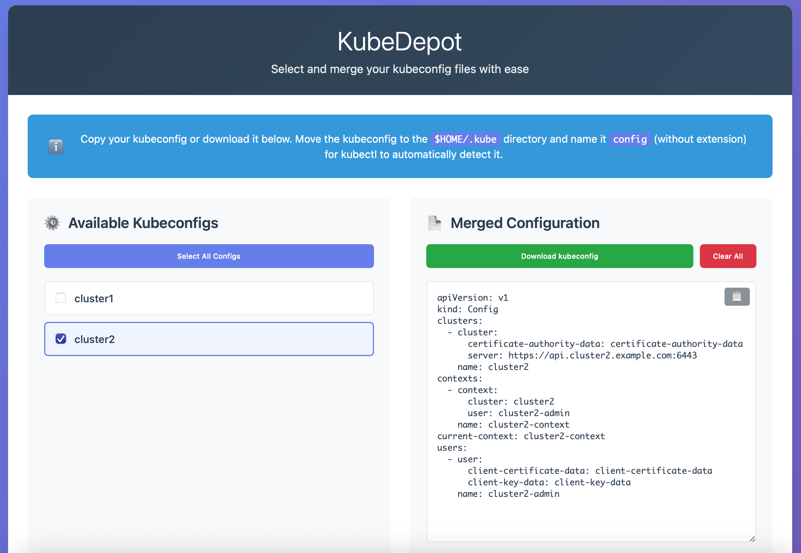

# KubeDepot

A simple web service for distributing Kubernetes configuration files.

## Features

- List all available kubeconfigs
- Get a specific kubeconfig
- Merge multiple kubeconfigs

Just like nginx serving several static files, but with a nice web UI and the ability to merge configs 😊

> ⚠️ This is a simple web service for distributing kubeconfigs that don't contain sensitive data. It intentionally has no authentication, encryption, authorization, or RBAC features.

For example, it's fine for distributing configs that use AWS CLI authentication, but not for configs with admin certificates or service account tokens.

## Web Interface



Also, it has API endpoints for getting kubeconfigs.

## Usage

Deploy the application using the Helm chart.

Check out the [KubeDepot Helm Chart Usage](https://github.com/rgeraskin/kubedepot/blob/master/HELM.md) for detailed chart configuration information.

```bash
helm repo add kubedepot https://rgeraskin.github.io/kubedepot/
helm install kubedepot kubedepot/kubedepot # This won't work without kubeconfigs
```

## Development

### Building the Application

1. Clone the repository
2. Run `go mod tidy` to fetch all dependencies
3. Build the application: `go build -o ./kubedepot ./cmd/kubedepot/`

The application includes embedded web templates for container deployment, but you can also use external templates from the `WEB_DIR` during development.

### Application Configuration

You can configure the application using these environment variables:

- `CONFIGS_DIR`: Directory containing kubeconfig files (default: `./configs`)
- `PORT`: HTTP server port (default: `8080`)
- `WEB_DIR`: Directory containing web templates (default: `./web`)
- `DEBUG`: Enable debug mode (default: `false`)

### Starting the Server

```bash
# Start with default settings
./kubedepot

# Or with custom settings
CONFIGS_DIR=/path/to/configs PORT=9090 ./kubedepot
```

### API Endpoints

#### List All Configs

```
GET /json/list
GET /yaml/list
```

Returns a list of all available kubeconfigs in either JSON or YAML format.

#### Get Configs

```
GET /json/get?name=<config-name>
GET /yaml/get?name=<config-name>
GET /yaml/get?name=<config-name>&name=<config-name2>
```

Returns kubeconfig(s) in either JSON or YAML format. You can specify multiple `name` parameters to merge configs.

If you don't provide a `name` parameter, all available configs will be merged.

#### Web Interface

```
GET /
```

Provides a simple web interface to browse and download available kubeconfigs.

## Storage

Kubeconfig files are stored as YAML files in the configured `CONFIGS_DIR`. File names should have a `.yaml` extension.
